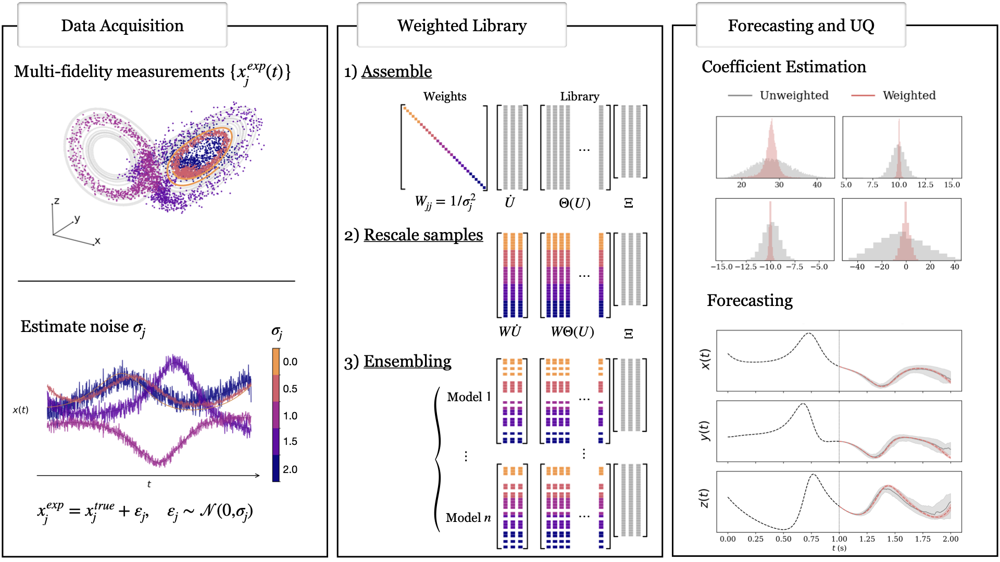

# Methodology Snapshot

MF–SINDy augments weak-form + ensemble SINDy with explicit fidelity modelling. The workflow consists of three stages:

1. **Goal & overview** – treat fidelity as an input by estimating noise variance per trajectory/time step, then propagate it through covariance-aware whitening before sparse regression.
2. **Stage 1 (fidelity annotation)** – collect LF/HF trajectories and estimate either trajectory-wise noise levels (Regime I) or time-varying variances (Regime II). These yield heteroscedastic variance profiles.
3. **Stage 2 (weak GLS weighting)** – assemble the weak system \((\mathbf{b}, \mathbf{G})\) using test functions, model the induced weak residual covariance, and whiten the system so sequential thresholding works with GLS weights.
4. **Stage 3 (ensemble & forecasting)** – bag rows of the whitened system, fit sparse ensembles, and propagate them to obtain forecast bands.
5. **Key novelty** – the weak-space covariance model captures heteroscedastic noise and makes whitening part of the solver rather than a preprocessing hack.

## Regime I – trajectory-wise homogeneous noise

Each trajectory \(k\) has variance \(\sigma_k^2\). The weak covariance is block diagonal with blocks \(\sigma_k^2 \Sigma_0\) (\(\Sigma_0 = V'(V')^\top\)), leading to a simple block whitening matrix
\[
W=\mathrm{diag}\left(\sigma_k^{-1}\Sigma_0^{-1/2}\right).
\]
Embedding this inside sequential thresholded least squares yields trajectory-weighted refits where low-noise trajectories dominate support selection.

## Regime II – trajectory-wise heterogeneous noise

Variance varies over time within each trajectory, so the weak covariance becomes
\[
\Sigma = V' D_\sigma (V')^\top,
\]
which is generally dense because test-function supports overlap. Whitening uses any \(W\) with \(W^\top W = \Sigma^{-1}\) (e.g., Cholesky factors). For multiple trajectories, each block uses its own diagonal variance profile \(D_{\sigma^{(k)}}\).

## Variance estimation

When noise levels are unknown, compare raw trajectories to smoothed versions (Savitzky–Golay or local polynomial filters) and smooth the squared residuals to obtain \(\hat{\sigma}_i^2\). Use absolute variances when calibrated, or relative weights when only ordering is trustworthy—the GLS weighting step only needs ratios.
